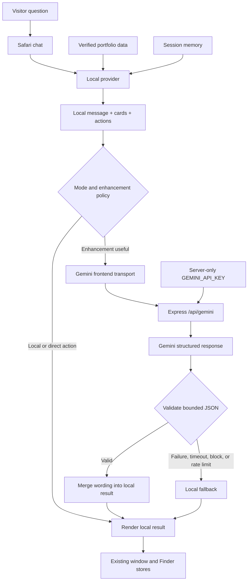

# Hybrid Assistant Flow

```mermaid
flowchart TD
    User["Visitor question"] --> Safari["Safari chat"]
    Safari --> Local["Local provider"]
    Data["Verified portfolio data"] --> Local
    Memory["Session memory"] --> Local
    Local --> LocalResult["Local message + cards + actions"]
    LocalResult --> Policy{"Mode and enhancement policy"}
    Policy -->|"Local or direct action"| Render["Render local result"]
    Policy -->|"Enhancement useful"| Frontend["Gemini frontend transport"]
    Frontend --> Backend["Express /api/gemini"]
    Key["Server-only GEMINI_API_KEY"] --> Backend
    Backend --> Gemini["Gemini structured response"]
    Gemini --> Validate{"Validate bounded JSON"}
    Validate -->|"Valid"| Merge["Merge wording into local result"]
    Validate -->|"Failure, timeout, block, or rate limit"| Fallback["Local fallback"]
    Merge --> Render
    Fallback --> Render
    Render --> Actions["Existing window and Finder stores"]
```
