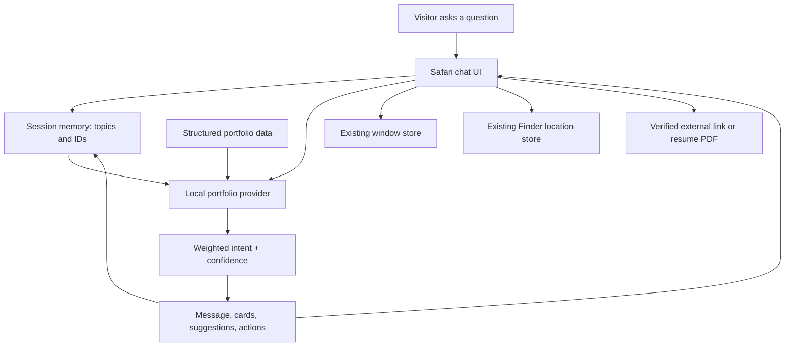

# Local Portfolio Chat Flow

```mermaid
flowchart TD
    Visitor["Visitor asks a question"] --> Safari["Safari chat UI"]
    Memory["Session memory: topics and IDs"] --> Engine["Local portfolio provider"]
    Safari --> Memory
    Safari --> Engine
    Data["Structured portfolio data"] --> Engine
    Engine --> Score["Weighted intent + confidence"]
    Score --> Response["Message, cards, suggestions, actions"]
    Response --> Memory
    Response --> Safari
    Safari --> WindowStore["Existing window store"]
    Safari --> FinderStore["Existing Finder location store"]
    Safari --> External["Verified external link or resume PDF"]
```
